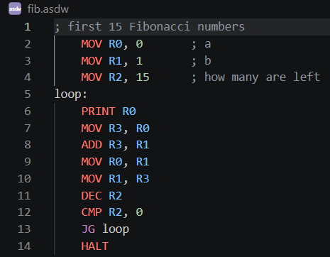

# Assemdows 1.0

A small assembly-style language that runs natively on Windows (and anywhere else C does).
Source files use the `.asdw` extension.

## Build and run

```
gcc -O2 -Wall -o assemdows.exe assemdows.c
assemdows examples\hello.asdw
```

Options: `--trace` (print each instruction as it runs), `--regs` (show registers at HALT),
`--seed N` (repeatable RAND), `--max-steps N` (stop infinite loops), `--version`, `--help`.
`HALT 3` makes the program exit with code 3 (check it with `%errorlevel%`).

## Basics

- One instruction per line. Comments start with `;`.
- Labels end with a colon and can share a line with an instruction: `loop: DEC R0`.
- Instructions, registers, and labels are not case sensitive.
- 16 registers, `R0` to `R15`, each a 32-bit signed integer.
- Numbers can be decimal (`42`, `-7`), hex (`0xFF`), binary (`0b101`), or characters (`'A'`, `'\n'`).
- Arithmetic wraps around on overflow instead of crashing.

## Instructions

| Group | Instructions |
|---|---|
| Move | `MOV Rd, v` |
| Math | `ADD SUB MUL DIV MOD Rd, v` (integer division; `MOD` keeps the remainder) |
| Single register | `INC DEC NEG NOT Rd` |
| Bits | `AND OR XOR SHL SHR Rd, v` (shift counts use 0 to 31) |
| Compare | `CMP a, b` sets the flag used by the jumps below |
| Jumps | `JMP JE JNE JG JL JGE JLE label` |
| Functions | `CALL label`, `RET` |
| Stack | `PUSH v`, `POP Rd` |
| Memory | `LOAD Rd, [addr]`, `STORE [addr], v` |
| Output | `PRINT v` (number and newline), `PRINTC v` (one character), `PRINTS addr` (text until a 0) |
| Input | `INPUT Rd` (a whole number), `GETC Rd` (one character, -1 at end of input) |
| Random | `RAND Rd, max` (0 up to max - 1) |
| Other | `NOP`, `HALT`, `HALT code` |

`v` means a register or a value. `a, b` in `CMP` can be either too.

Full documentation: [Docs.md](Docs.md)

## Memory and data

There are 65,536 memory cells, each holding one integer. Data directives fill memory from address 0:

```
.equ SIZE, 8                    ; constant, no memory used
nums:  .word 5, 3, 9            ; three cells
text:  .string "Hi\n"           ; one cell per character, plus a 0 at the end
buf:   .space 20                ; 20 cells set to 0
```

A label in front of a data directive is that data's address. Addresses go in square brackets:

```
LOAD R0, [nums]        ; first element
LOAD R0, [nums+R1]     ; element number R1
LOAD R0, [R2-1]        ; address in R2, minus 1
STORE [buf+3], 99
MOV R1, text           ; R1 = address of the text
```

Constants from `.equ` must be defined before a data directive uses them.

## Errors

Mistakes are reported with the file and line number. Running problems (division by zero, bad memory
address, empty stack, running past the end without `HALT`) print the line that caused them and exit with code 1.

## VS Code

Download "assemdows-v*.vsix" and go to VS Code > Extensions > Options > Download from VSIX > select the file.
Then restart VS Code.

## Images


